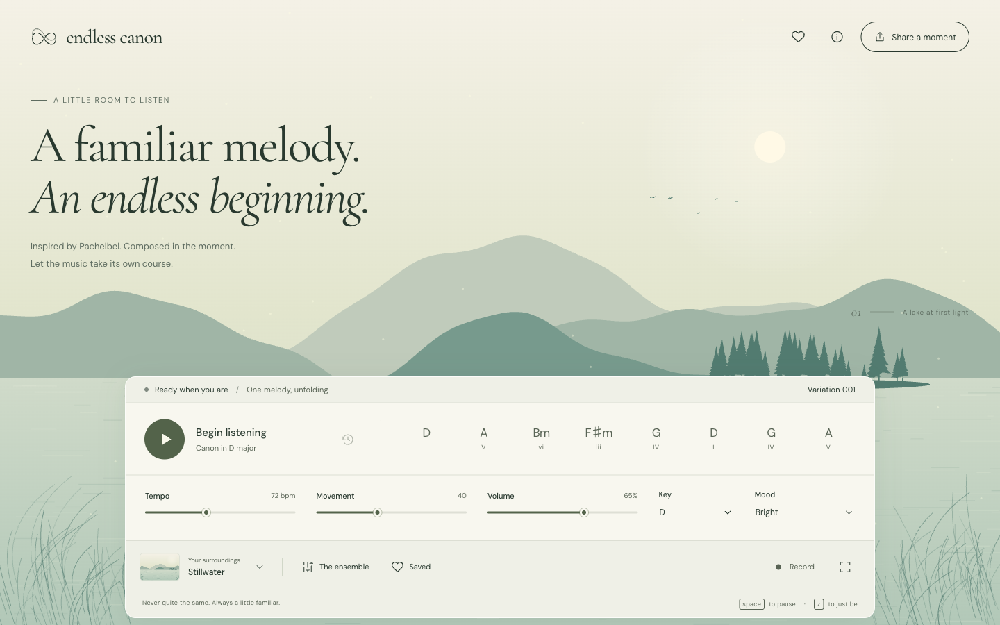

# Endless Canon

A familiar melody. An endless beginning.

An ambient music instrument inspired by Pachelbel's Canon: a generative melody, three echoing voices, and six living nature scenes. Everything is composed and drawn in your browser.



## Run locally

Requires **Node.js 20.19+** and npm. CI uses Node 22.

```sh
npm ci
npm run dev
```

Open the local URL printed by Vite, normally [localhost:5173](http://localhost:5173), and press **Play**. There is no backend, API key, remote sample download or account setup.

```sh
npm run check   # lint, 29 unit/invariant tests, typecheck and production build
npm run preview
```

## The listening experience

- **An evolving canon.** The I–V–vi–iii–IV–I–IV–V progression grounds each 16-beat phrase. A second and third voice enter after one and two full cycles. Six stages move from calm to flowing, lively, playful, ornamented and rest.
- **Your own ensemble.** Blend canon voices, ground bass, soft keys, sustained strings, plucked strings and synthesized nature air. Four presets offer a starting point.
- **Six surroundings.** Stillwater, Forest light, Last light, In bloom, Northern night and After the rain. Notes make ripples or particles; chords tint the atmosphere. Optional scene rotation follows every four variations.
- **A little control.** Set tempo, movement, volume, key and mood. Dreamy slows the tempo and adds reverb; Wistful uses the minor progression.
- **Gentle transitions.** Setting changes get a soft overlay. Key, mood and movement fade out and back in; tempo glides, mixer gains ease, and scenery dissolves into the next view. Repeated choices settle on the latest selection.
- **Moments to keep.** Rewind, save up to 20 sessions on this device, or share a versioned URL containing the seed, current variation, mix and settings. Shared sessions start silently; press Play to revisit them.
- **Record the music.** Start and stop a recording of up to five minutes. Downloads WebM/Opus or M4A where supported. No microphone is requested; this version does not export WAV or MP3.
- **Room to breathe.** Zen hides the controls; reduced-motion preferences keep the scene still. Controls support keyboard and touch.

| Shortcut | Action                    |
| -------- | ------------------------- |
| Space    | Play / pause              |
| ←        | Rewind one variation      |
| Z        | Enter Zen                 |
| Escape   | Exit Zen / close a dialog |

Form controls and buttons retain their normal keyboard behavior.

## How it works

```text
seed + settings + cycle
          ↓
pure composition engine → bounded phrase cache → three delayed voices
                                                   ↓
                            Web Audio look-ahead scheduler
                                    ↓              ↓
                          synth / mix / output    timed music events
                                                       ↓
                                               Canvas 2D scenes
```

Vite and strict TypeScript keep the application small. Native Web Audio provides additive synthesized timbres, stereo placement, shared reverb, compression and soft limiting. A timer worker schedules ahead of the audio clock. Canvas 2D caches scenery and renders bounded particles at a 30 fps ceiling and capped pixel density. Fonts are self-hosted.

Melody is deterministic for a given **v1 seed + key + mood + movement + cycle**. Tempo and mix affect playback, not note selection. Changing key, mood or movement fades the audio out before restarting the current variation, then fades it back in so delayed voices remain in the same tonal system. Sharing captures a configuration and starting variation; it does not record earlier control changes.

Read [architecture and decisions](docs/architecture.md), [design brief](DESIGN.md), [verification](docs/verification.md), and [the original plan](docs/project-plan.md).

## Current boundaries

This is a usable first release, not completion of every stretch goal. Timbres and ambience are synthesized. Strict counterpoint, auto-modulation, lo-fi beat/vinyl, recognition surveys, comparison against Pachelbel phrase transcriptions, realistic nature recordings, WAV/MP3 encoding and ML composition remain future work. A seeded rule-based engine cannot promise no short phrase will ever repeat.

Chromium desktop and responsive viewports were checked, including actual audio output and a downloaded recording. Safari/iOS, actual phone performance, subjective musical quality, and a two-hour real-time soak remain unverified. Operating systems can suspend background browser audio; press Play to resume after an interruption.

## Build and hosting

`npm run build` writes a static site to `dist/`. Relative asset paths support a root domain or repository subpath. Serve `dist/` over HTTPS using your chosen static host. Verification CI is included; no site is automatically deployed.

No analytics or remote runtime media are used. Favorites stay in `localStorage`; share URLs contain composition settings. DM Sans and Cormorant Garamond are distributed under their [bundled SIL Open Font licenses](public/licenses/).
