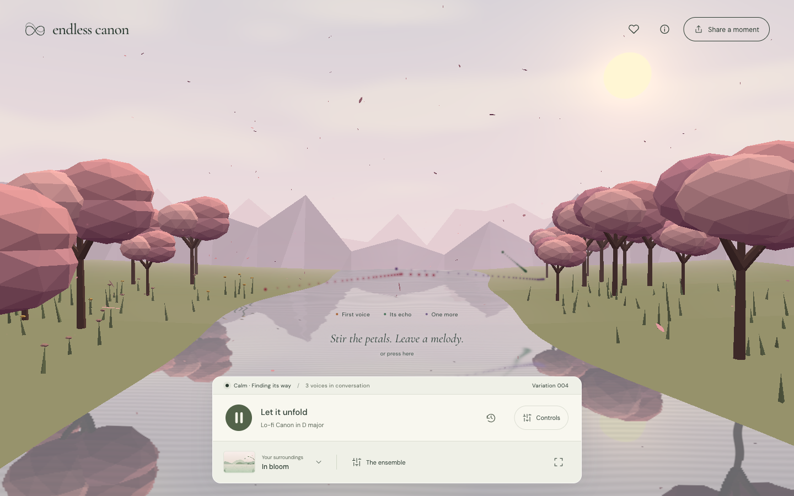

# Endless Canon

A familiar melody. An endless beginning.

[Listen on GitHub Pages](https://wildanniam.github.io/canon-endless/)

An ambient music instrument inspired by Pachelbel's Canon: a generative melody, three echoing voices, and six living nature scenes. Everything is composed and drawn in your browser.



## Run locally

Requires **Node.js 20.19+** and npm. CI uses Node 22.

```sh
npm ci
npm run dev
```

Open the local URL printed by Vite, normally [localhost:5173](http://localhost:5173), and press **Play**. There is no backend, API key, remote sample download or account setup.

```sh
npm run check   # lint, 45 unit/invariant tests, typecheck and production build
npm run preview
```

## The listening experience

- **An evolving canon.** The I–V–vi–iii–IV–I–IV–V progression grounds each 16-beat phrase. A second and third voice enter after one and two full cycles. Six stages move from calm to flowing, lively, playful, ornamented and rest.
- **Your own ensemble.** Blend canon voices, ground bass, soft keys, sustained strings, plucked strings, synthesized nature air, soft drums and vinyl texture. Five presets offer a starting point.
- **A lo-fi afternoon.** Choose **Style → Lo-fi** for a separate syncopated melody, warm electric-piano timbre, subtle pitch drift, swung eighths and a soft beat at 68 bpm. Adjust Soft drums and Vinyl texture in The ensemble. Switching style loads its starting mix and tempo; other controls remain yours to shape.
- **Six 3D surroundings.** Stillwater pairs mist, pine shores and lily pads with a reflective dawn lake. Forest light follows a mossy path under a canopy with sunbeams and fireflies. Last light opens onto layered peaks, low clouds and circling birds. In bloom surrounds a pond with cherry trees and drifting petals. After the rain combines a wet meadow, flowers, showers and a soft rainbow. Aurora Lake retains its mountains, wooded shores and flowing northern lights. Optional rotation follows every four variations.
- **A landscape you can play.** Three trails follow the actual canon voices. Press Play to reveal the scene and compact dock; Controls expands it. Tap the water or air, or use the scene's labeled note button with the keyboard, to add quiet chord tones on the next unscheduled eighth. Touches create bounded light bursts and water rings; in the cherry grove they also stir petals. Lightweight scenery returns to the illustrated scenes; unavailable/lost WebGL falls back automatically.
- **A little control.** Set tempo, movement, volume, key and mood. Dreamy slows the tempo and adds reverb; Wistful uses the minor progression.
- **Gentle transitions.** Setting changes get a soft overlay. Key, mood and movement fade out and back in; tempo glides, mixer gains ease, and scenery dissolves into the next view. Repeated choices settle on the latest selection.
- **Moments to keep.** Rewind, save up to 20 sessions on this device, or share a versioned URL containing the seed, current variation, mix and settings. Shared sessions start silently; press Play to revisit them.
- **Record the music.** Start and stop a recording of up to five minutes. Downloads WebM/Opus or M4A where supported. No microphone is requested; this version does not export WAV or MP3.
- **Room to breathe.** Zen hides the controls; reduced-motion preferences keep the scene still. Controls support keyboard and touch.

| Shortcut | Action                    |
| -------- | ------------------------- |
| Space    | Play / pause              |
| ←        | Rewind one variation      |
| Z        | Enter Zen                 |
| Escape   | Exit Zen / close a dialog |

Form controls and buttons retain their normal keyboard behavior.

## How it works

```text
seed + settings + cycle
          ↓
pure composition engine → bounded phrase cache → three delayed voices
                                                   ↓
                            Web Audio look-ahead scheduler
                                    ↓              ↓
                          synth / mix / output    timed music events
                                                       ↓
                                               Canvas 2D / optional Three.js worlds
```

Vite and strict TypeScript keep the application small. Native Web Audio provides additive synthesized timbres, stereo placement, shared reverb, compression and soft limiting. A timer worker schedules ahead of the audio clock. Canvas 2D caches scenery and renders bounded particles at a 30 fps ceiling and capped pixel density. A separate Three.js chunk initializes the selected world without blocking controls; procedural shaders need no external images or models. One renderer and context are reused across scenes; outgoing geometries, instance buffers, materials and reflection targets are released. Resolution and reflection textures are capped, with a one-way quality downgrade under sustained render cost. Fonts are self-hosted.

Melody is deterministic for a given **v1 seed + style + key + mood + movement + cycle**. Tempo and mix affect playback, not note selection. Changing style, key, mood or movement fades the audio out before restarting the current variation, then fades it back in so delayed voices remain in the same tonal system. Sharing captures a configuration and starting variation; it does not record earlier control changes or landscape gestures. Audio recordings include gesture notes through the same melody/master output.

Read [architecture and decisions](docs/architecture.md), [design brief](DESIGN.md), [verification](docs/verification.md), and [the original plan](docs/project-plan.md).

## Current boundaries

This is a usable first release, not completion of every stretch goal. Timbres and ambience are synthesized. Strict counterpoint, auto-modulation, recognition surveys, comparison against Pachelbel phrase transcriptions, realistic nature recordings, WAV/MP3 encoding and ML composition remain future work. A seeded rule-based engine cannot promise no short phrase will ever repeat.

Chromium desktop and responsive viewports were checked, including actual audio output and a downloaded recording. Safari/iOS, actual phone performance, subjective musical quality, and a two-hour real-time soak remain unverified. Operating systems can suspend background browser audio; press Play to resume after an interruption.

## Build and hosting

`npm run build` writes a static site to `dist/`. Relative asset paths support a root domain or repository subpath. The `Deploy GitHub Pages` workflow runs the full checks and publishes only `dist/` to [GitHub Pages](https://wildanniam.github.io/canon-endless/). Pushes to `codex/1-endless-canon` publish the initial release while PR #2 is open; pushes to `main` also deploy once the workflow is merged. After merging, remove the temporary implementation-branch trigger. The PR is not automatically merged.

Pages uses GitHub Actions as its publishing source. Deployment needs only the built-in short-lived GitHub token/OIDC permissions, no repository secrets. To redeploy, push a verified change to a configured publishing branch; after this workflow exists on the default branch, it can also be dispatched manually. The environment must permit the publishing branch. Deployment is serialized and gated on the build job. See [GitHub’s custom Pages workflow documentation](https://docs.github.com/en/pages/getting-started-with-github-pages/using-custom-workflows-with-github-pages).

No analytics or remote runtime media are used. Favorites stay in `localStorage`; share URLs contain composition settings. DM Sans and Cormorant Garamond are distributed under their [bundled SIL Open Font licenses](public/licenses/).

Three.js and its Reflector addon use the [bundled MIT license](public/licenses/THREE.txt). The terrain and shader artwork are authored locally for this app.
